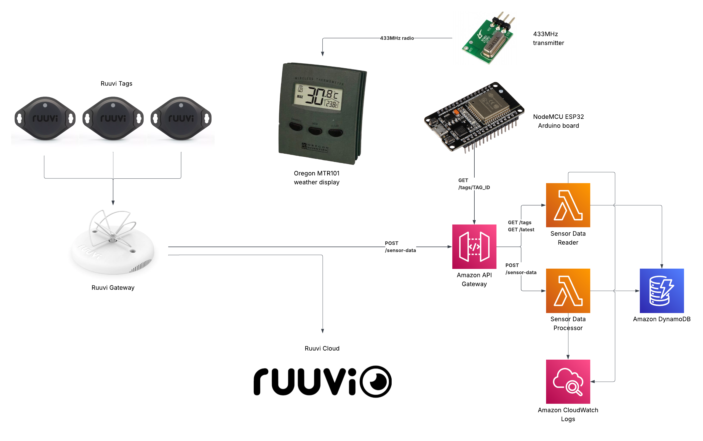

# AWS API Gateway for Ruuvi Gateway 

AWS serverless API for storing and processing sensor data from Ruuvi Gateway devices.

## Overview

This API receives environmental sensor data from Ruuvi Gateway devices and stores it in DynamoDB. The system processes multiple Ruuvi sensor tags per gateway transmission, tracking temperature, humidity, pressure, and battery voltage measurements.

Ruuvi Gateway can be [configured to send data to multiple targets](https://docs.ruuvi.com/ruuvi-gateway-firmware/gateway-html-pages/cloud-options/backend-http-s) at the same time, ie. you can continue using Ruuvi Cloud while deploying your private HTTP(S) backend. [Cloudformation template](./cloudformation.yaml) implements AWS API Gateway compatible with Ruuvi Gateway HTTPS spec.

API can also be used to query measurement data stored from Ruuvi Gateway. This can be used to build your own webUI or as backend for physical weather displays. This repo has [nodemcu_oregon_tx.ino](./nodemcu_oregon_tx.ino) as an example of Arduino sketch for NodeMCU device that gets measurement data from API and transmits it using Oregon THN128 sensor protol to be displayed at compatible weather display. You also need 433MHz transmitter like FS100A or RFM85W-433D. In [depedencies](./dependencies) are links and snapshots to dependencies of Arduino sketch.



## Architecture

- **API Gateway**: REST API endpoint for receiving sensor data
- **Lambda**: Python 3.11 function running on ARM64 (Graviton2)
- **DynamoDB**: Two tables for historical data and latest readings
- **CloudWatch Logs**: 14-day retention for Lambda logs

## API Endpoints

### Base URL
```
https://{api-id}.execute-api.{region}.amazonaws.com/v1
```

### POST /sensor-data

Submit sensor data from Ruuvi Gateway.

**Authentication**: None

**Request Headers**:
```
Content-Type: application/json
```

**Request Body**:
```json
{
  "data": {
    "gw_mac": "AA:BB:CC:DD:EE:FF",
    "timestamp": 1761484468,
    "nonce": 165935724,
    "coordinates": "",
    "tags": {
      "11:22:33:44:55:66": {
        "id": "11:22:33:44:55:66",
        "timestamp": 1761484466,
        "temperature": 22.455,
        "humidity": 44.2250,
        "pressure": 98403,
        "voltage": 2.798,
        "measurementSequenceNumber": 36667
      }
    }
  }
}
```

**Required Fields**:
- `data.gw_mac` - Gateway MAC address
- `data.timestamp` - Gateway timestamp (Unix epoch)
- `data.tags.*.id` - Sensor tag ID
- `data.tags.*.measurementSequenceNumber` - Measurement sequence number

**Optional Fields**:
- `data.tags.*.timestamp` - Tag timestamp (defaults to gateway timestamp)
- `data.tags.*.temperature` - Temperature in Celsius
- `data.tags.*.humidity` - Humidity percentage
- `data.tags.*.pressure` - Pressure in Pascals
- `data.tags.*.voltage` - Battery voltage in volts

**Response (200 OK)**:
```json
{
  "message": "Successfully processed 6 sensor readings",
  "gateway_mac": "AA:BB:CC:DD:EE:FF",
  "timestamp": 1761484468
}
```

**Response (400 Bad Request)**:
```json
{
  "error": "Missing required fields: gw_mac or timestamp",
  "request_payload": { ... }
}
```

**Response (500 Internal Server Error)**:
```json
{
  "error": "Internal server error",
  "error_details": "Error message",
  "request_payload": { ... }
}
```

### GET /sensor-data

Health check endpoint.

**Authentication**: None

**Response (200 OK)**:
```json
{
  "status": "ok",
  "message": "Ruuvi Gateway API is running",
  "timestamp": "Wed, 25 Dec 2024 12:00:00 GMT"
}
```

### OPTIONS /sensor-data

CORS preflight endpoint.

**Authentication**: None

**Response Headers**:
```
Access-Control-Allow-Origin: *
Access-Control-Allow-Methods: GET,POST,OPTIONS
Access-Control-Allow-Headers: Content-Type,X-Amz-Date,Authorization,X-Api-Key,X-Amz-Security-Token
```

## Read Endpoints

### GET /latest

Get the latest reading for all sensor tags.

**Authentication**: None

**Response (200 OK)**:
```json
{
  "count": 6,
  "items": [
    {
      "tag_id": "11:22:33:44:55:66",
      "measurementSequenceNumber": 36667,
      "timestamp": 1761484466,
      "gateway_mac": "AA:BB:CC:DD:EE:FF",
      "temperature": 22.455,
      "humidity": 44.225,
      "pressure": 98403,
      "voltage": 2.798,
      "ttl": 1769260468
    }
  ]
}
```

### GET /tags/{tagId}

Get the latest reading for a specific sensor tag.

**Authentication**: None

**Path Parameters**:
- `tagId` - Sensor tag identifier (e.g., `DC:8B:E7:24:29:6F`)

**Response (200 OK)**:
```json
{
  "tag_id": "11:22:33:44:55:66",
  "measurementSequenceNumber": 36667,
  "timestamp": 1761484466,
  "gateway_mac": "AA:BB:CC:DD:EE:FF",
  "temperature": 22.455,
  "humidity": 44.225,
  "pressure": 98403,
  "voltage": 2.798,
  "ttl": 1769260468
}
```

**Response (404 Not Found)**:
```json
{
  "error": "Tag not found"
}
```

### GET /tags/{tagId}/history

Get historical readings for a specific sensor tag.

**Authentication**: None

**Path Parameters**:
- `tagId` - Sensor tag identifier

**Query Parameters**:
- `limit` - Maximum number of readings to return (default: 100, max: 1000)

**Example Request**:
```
GET /tags/11:22:33:44:55:66/history?limit=50
```

**Response (200 OK)**:
```json
{
  "tag_id": "11:22:33:44:55:66",
  "count": 50,
  "items": [
    {
      "tag_id": "11:22:33:44:55:66",
      "measurementSequenceNumber": 36667,
      "timestamp": 1761484466,
      "temperature": 22.455,
      "voltage": 2.798
    }
  ]
}
```

**Note**: Results are sorted by measurement sequence number in descending order (most recent first).

## Tag Aliases

You can define human-readable aliases for sensor tag IDs and use them in any GET endpoint that accepts a `{tagId}` path parameter. Aliases are configured as Lambda environment variables on the `SensorDataReader` function.

### How it works

When a GET request includes a `tagId` in the path, the reader Lambda checks whether an environment variable exists with a name matching the supplied `tagId`. If found, the variable's **value** (the real sensor MAC address) is used to query DynamoDB. Otherwise, the supplied `tagId` is used as-is.

The names `SENSOR_DATA_TABLE` and `LATEST_READINGS_TABLE` are reserved and cannot be used as aliases.

### Configuring aliases

Add entries under `Environment.Variables` of the `SensorDataReader` resource in `cloudformation.yaml`:

```yaml
SensorDataReader:
  Type: AWS::Lambda::Function
  Properties:
    ...
    Environment:
      Variables:
        SENSOR_DATA_TABLE: !Ref SensorDataTable
        LATEST_READINGS_TABLE: !Ref LatestReadingsTable
        livingroom: "AA:BB:CC:DD:EE:01"
        bedroom:    "AA:BB:CC:DD:EE:02"
        sauna:      "AA:BB:CC:DD:EE:03"
```

Then redeploy the stack:

```bash
aws cloudformation deploy \
  --template-file cloudformation.yaml \
  --stack-name ruuvi-gateway-api \
  --capabilities CAPABILITY_NAMED_IAM
```

### Usage examples

With the aliases above configured:

```bash
# Resolves to AA:BB:CC:DD:EE:01
curl https://{api-id}.execute-api.{region}.amazonaws.com/v1/tags/livingroom

# Works on history endpoint as well
curl "https://{api-id}.execute-api.{region}.amazonaws.com/v1/tags/bedroom/history?limit=50"

# Real sensor IDs still work directly
curl https://{api-id}.execute-api.{region}.amazonaws.com/v1/tags/AA:BB:CC:DD:EE:01
```

### Notes

- Alias names are **case-sensitive** and must be valid Lambda environment variable names (alphanumerics and underscores; cannot start with `AWS_`).
- The response body still contains the real `tag_id` (the resolved MAC address), not the alias.
- Aliases only apply to the read endpoints. Incoming sensor data via `POST /sensor-data` is always stored under the real tag ID reported by the gateway.

## Data Storage

### SensorDataTable

Stores all historical sensor readings with 90-day TTL.

**Primary Key**:
- `tag_id` (HASH) - Sensor tag identifier
- `measurementSequenceNumber` (RANGE) - Measurement sequence number

**Attributes**:
- `timestamp` - Reading timestamp (Unix epoch)
- `gateway_mac` - Gateway MAC address
- `temperature` - Temperature in Celsius (Decimal)
- `humidity` - Humidity percentage (Decimal)
- `pressure` - Pressure in Pascals (Decimal)
- `voltage` - Battery voltage in volts (Decimal)
- `ttl` - Time-to-live for automatic deletion

**Global Secondary Index (TimestampIndex)**:
- `tag_id` (HASH)
- `timestamp` (RANGE)

### LatestReadingsTable

Stores only the latest reading per sensor tag.

**Primary Key**:
- `tag_id` (HASH) - Sensor tag identifier

**Attributes**: Same as SensorDataTable

## Query Examples

### Get Latest Reading for Specific Tag

```python
import boto3

dynamodb = boto3.resource('dynamodb')
table = dynamodb.Table('ruuvi-latest-readings-{stack-name}')

response = table.get_item(
    Key={'tag_id': '11:22:33:44:55:66'}
)
latest_reading = response['Item']
```

### Get All Latest Readings

```python
response = table.scan()
all_latest_readings = response['Items']
```

### Get Tag History

```python
table = dynamodb.Table('ruuvi-sensor-data-{stack-name}')

response = table.query(
    KeyConditionExpression='tag_id = :id',
    ExpressionAttributeValues={':id': '11:22:33:44:55:66'},
    ScanIndexForward=False,  # Most recent first
    Limit=100
)
history = response['Items']
```

### Get Latest Measurement for Tag

```python
response = table.query(
    KeyConditionExpression='tag_id = :id',
    ExpressionAttributeValues={':id': '11:22:33:44:55:66'},
    ScanIndexForward=False,
    Limit=1
)
latest = response['Items'][0]
```

### Get Readings by Time Range

```python
response = table.query(
    IndexName='TimestampIndex',
    KeyConditionExpression='tag_id = :id AND #ts BETWEEN :start AND :end',
    ExpressionAttributeNames={'#ts': 'timestamp'},
    ExpressionAttributeValues={
        ':id': '11:22:33:44:55:66',
        ':start': 1761484000,
        ':end': 1761485000
    }
)
readings = response['Items']
```

## Deployment

### Prerequisites

- AWS CLI configured with appropriate credentials
- AWS account with permissions for CloudFormation, Lambda, API Gateway, and DynamoDB

### Deploy Stack

```bash
aws cloudformation deploy \
  --template-file cloudformation.yaml \
  --stack-name ruuvi-gateway-api \
  --capabilities CAPABILITY_NAMED_IAM \
  --parameter-overrides ApiStageName=v1
```

### Get API Endpoint

```bash
aws cloudformation describe-stacks \
  --stack-name ruuvi-gateway-api \
  --query 'Stacks[0].Outputs[?OutputKey==`ApiEndpoint`].OutputValue' \
  --output text
```

### Update Stack

```bash
aws cloudformation deploy \
  --template-file cloudformation.yaml \
  --stack-name ruuvi-gateway-api \
  --capabilities CAPABILITY_NAMED_IAM
```

### Delete Stack

```bash
aws cloudformation delete-stack --stack-name ruuvi-gateway-api
```

### Force API Gateway Deployment

If you add or modify API methods and they don't appear in the stage after stack update, manually deploy the API.

> **Note:** A `"Missing Authentication Token"` response from a route you know exists (e.g. `GET /v1/tags/{tagId}`) is API Gateway's default message when the request doesn't match any deployed route. If `cloudformation deploy` succeeded but the new route still 403s with that message, the stage hasn't picked up the new resources — run the redeploy below.

**AWS Console:**
1. Go to API Gateway → Your API
2. Click "Resources"
3. Click "Actions" → "Deploy API"
4. Select stage "v1"
5. Click "Deploy"

**AWS CLI:**
```bash
# Get the API ID
API_ID=$(aws cloudformation describe-stacks \
  --stack-name ruuvi-gateway-api \
  --query 'Stacks[0].Outputs[?OutputKey==`ApiBaseUrl`].OutputValue' \
  --output text | cut -d'/' -f3 | cut -d'.' -f1)

# Create a new deployment
aws apigateway create-deployment \
  --rest-api-id $API_ID \
  --stage-name v1
```

## Testing

### Test Health Check

```bash
curl https://{api-id}.execute-api.{region}.amazonaws.com/v1/sensor-data
```

### Submit Sample Data

```bash
curl -X POST https://{api-id}.execute-api.{region}.amazonaws.com/v1/sensor-data \
  -H "Content-Type: application/json" \
  -d @sample-payload.json
```

### Get All Latest Readings

```bash
curl https://{api-id}.execute-api.{region}.amazonaws.com/v1/latest
```

### Get Specific Tag's Latest Reading

```bash
curl https://{api-id}.execute-api.{region}.amazonaws.com/v1/tags/11:22:33:44:55:66
```

### Get Tag History

```bash
# Get last 50 readings
curl "https://{api-id}.execute-api.{region}.amazonaws.com/v1/tags/11:22:33:44:55:66/history?limit=50"

# Get last 100 readings (default)
curl https://{api-id}.execute-api.{region}.amazonaws.com/v1/tags/11:22:33:44:55:66/history
```

## Configuration

### Lambda Settings

- **Runtime**: Python 3.11
- **Architecture**: ARM64 (Graviton2)
- **Memory**: 128 MB
- **Timeout**: 30 seconds
- **Log Retention**: 14 days

### DynamoDB Settings

- **Billing Mode**: Pay-per-request (on-demand)
- **TTL**: 90 days for historical data
- **Backup**: Not configured (add as needed)

## Monitoring

### CloudWatch Logs

Lambda logs are available at:
```
/aws/lambda/ruuvi-sensor-processor-{stack-name}
```

### CloudWatch Metrics

Monitor these metrics:
- Lambda invocations, errors, duration
- API Gateway 4xx/5xx errors, latency
- DynamoDB read/write capacity, throttles

## Cost Optimization

- ARM64 Lambda provides 20% cost savings vs x86
- 128 MB memory allocation minimizes Lambda costs
- Pay-per-request DynamoDB billing for variable workloads
- 14-day log retention reduces CloudWatch storage costs
- 90-day TTL automatically removes old data

## Data Format

The API accepts Ruuvi Data Format 5. See `sample-payload.json` for a complete example.

**Supported Sensor Fields**:
- Temperature (Celsius)
- Humidity (percentage)
- Pressure (Pascals)
- Voltage (volts)

**Note**: Other fields in the Ruuvi payload (acceleration, RSSI, BLE details) are ignored by the current implementation.

## Error Handling

All errors include the full request payload in CloudWatch Logs for debugging. Error responses include:
- Error message
- Error details (for 500 errors)
- Original request payload

## Security

- No authentication required (configure API keys or IAM auth as needed)
- CORS enabled for all origins
- Lambda execution role follows least-privilege principle
- CloudWatch Logs encrypted at rest

## Limitations

- Maximum payload size: 6 MB (API Gateway limit)
- Lambda timeout: 30 seconds
- DynamoDB item size: 400 KB
- No duplicate detection (same sequence number overwrites)

## Support

For issues or questions, check CloudWatch Logs for detailed error information including full request payloads.
